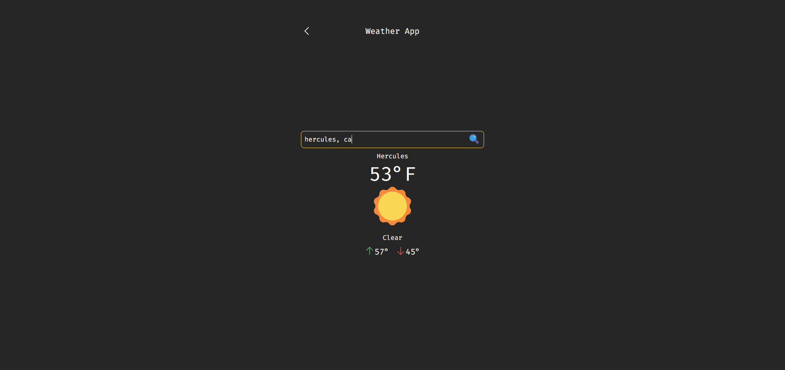
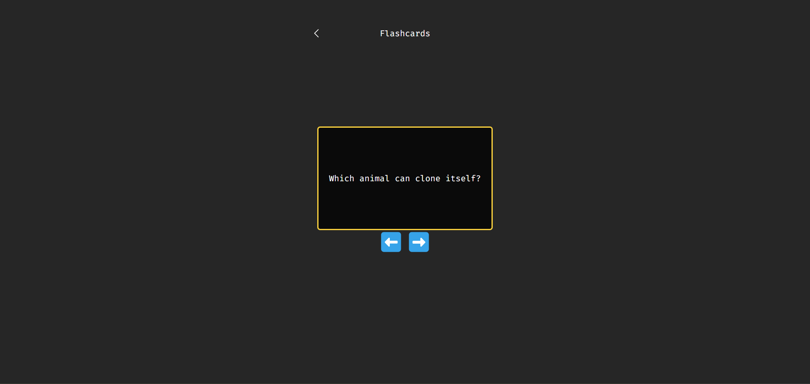

# Mini Projects

### Table of Contents

-   [About](#about)
    -   [Tools](#tools)
    -   [Design](#design)
    -   [Challenges](#challenges)
    -   [What I Learned](#what-i-learned)
-   [Features](#features)
    -   [To-Do List](#to-do-list)
    -   [Tic-Tac-Toe](#tic-tac-toe)
    -   [Weather App](#weather-app)
    -   [Memory Card Game](#memory-card-game)
    -   [Flashcards](#flashcards)
-   [Getting Started](#getting-started)
    -   [Prerequisites](#prerequisites)
    -   [Installation](#installation)
-   [Contact](#contact)

# About

Mini Projects consists of 5 projects:

-   Cipher Puzzle
-   Tic-Tac-Toe
-   Weather App
-   Memory Card Game
-   Flashcards


### Tools

&nbsp;
&nbsp;


### Design

I originally began working on these projects with vanilla JS and had completed four of them. However, it looked horrible. I can copy other designs but creating them myself is not my forte. This is when I realized just diving in coding without a particular design or layout in mind is not the best idea.

So, the design I implemented came from inspiration from a YouTuber I follow, ForrestKnight. He had created a mini-game website which I thought looked great with a minimal design. I used his design as a guide, although I wasn't aiming for an exact clone. I just used it as a reference. I also implemented two of his project ideas, the cipher and the memory card game.

I worked mostly on functionality for these projects. I used React to have seamless transitions between the projects and also for state management. The router allowed for an easy way to create a single-page app. It also helped with organization as each project is a separate component.

### Challenges

Nearly everything about these projects was difficult for me. Even though I spent months completing the Meta Front-End Developer Certificate and supplemented that with even more Codecademy certificates, I still found myself constantly stuck.

One of the harder challenges I faced was with the weather app. I had almost no experience fetching data and using an API. Also, I didn't know that in order to search for a location, that location would first need to be converted to longitude and lagitute coordinates which required me to use a geocoding API for that as well.

### What I Learned

While these projects took longer and were harder than I had originally expected, I still enjoyed the process. I found myself working on them whenever I had time. When I got stuck, I first tried my best to figure it myself. If I couldn't, then I used ChatGPT as my main go-to resource. It's very nice having an all-in-one resource instead of me having to search on Google, find the best resource, look through MDN, etc. I had to resort to it many times with questions such as, "How do I use fetch()?", "Remind me what useEffect does and its syntax", etc.

This was also my first time using Tailwind and I love it. It makes writing CSS so much easier. I don't have to think of class names, worry about specificity, write out long media queries, etc. I also appreciate how it lets you know the exact CSS it's using when hovering over its classes.

Concepts learned/practiced:

-   Tailwind
-   Toggling with booleans
-   useState, useEffect, useNavigate
-   React router
-   Data fetching from the OpenWeather API
-   Conditional rendering/styling
-   Event listening/handling

# Features

### Cipher Puzzle


My first mini-project was actually a to-do list. Later, I changed it to be this cipher puzzle which was more interesting to me. I got the idea from ForrestKnight.

This is a fun challenge which showcases a Caesar cipher. It shifts each letter in the alphabet by three. The letter a, for example, would become d. I created a function, encrypt(), which will encrypt the message. This takes in a string and uses a nested loop to shift each letter by adding three to its index if it's in the alphabet. I used the modulo operator for when the shifted index would exceed 25. This prevents trying to access out-of-bounds letters which would result in undefined.

```js
function encrypt(message) {
	const alphabet = 'abcdefghijklmnopqrstuvwxyz';
	let encryptedMessage = '';

	for (let i = 0; i < message.length; i++) {
		if (message[i] === ' ') {
			encryptedMessage += ' ';
			continue;
		}

		for (let j = 0; j < alphabet.length; j++) {
			if (message[i].toLowerCase() === alphabet[j]) {
				const shiftedIndex = (j + 3) % alphabet.length;
				encryptedMessage += alphabet[shiftedIndex];
				break;
			}
		}
	}

	return encryptedMessage;
}
```

I used the useState hook to keep track of state for the input, error, clue, and solved status. When solved, the setTimeout function will activate after 2 seconds, and useNavigate will return the user to the home page.

```js
const handleClick = () => {
	if (input.toLowerCase().trim() === message.toLowerCase().trim()) {
		setSolved(true);
		setTimeout(() => {
			navigate('/');
		}, 2000);
	} else {
		setShowError(true);
		setTimeout(() => {
			setShowError(false);
		}, 2000);
	}
};
```

Writing in JSX and using Tailwind was convenient because it allowed me to write all my HTML, JS, and CSS (tailwind) in a single file. It's also nice to easily incorporate conditional rendering. Here's an example of displaying the error when its state is true, and the button when it's false.

```jsx
        {showError ? (
	        <p className='p-2 text-center text-xl font-semibold text-red-500'>
		        Wrong answer. Try again!
	        </p>
        ) : (
	        <button
		        onClick={handleClick}
		        className='mx-auto w-1/2 rounded bg-yellow-400 p-2 text-xl font-semibold hover:opacity-75'>
		        Decipher
	        </button>
        )}
    </div>
)}
```

Features:

-   clue reveal by clicking on key
-   error message when wrong answer is submitted
-   congratulations page when solved which transitions back home
-   basic validation
-   useState, useNavigate hooks

### Tic-Tac-Toe


This project was built upon from the tic-tac-toe tutorial on react.dev. I went through the tutorial awhile back and thought it would be fun to rebuild it with a better UI and extend it. While its core logic is from the tutorial, some of it is extended. In this version, I implemented a reset feature which clears the board and resets the game's state. I also made it have conditional rendering for the winning squares so it is more obvious when winning. There is also a draw status when all squares are filled and there is no winner. I used grid and flexbox for the display.

Features:

-   state management
-   conditional rendering/styling for winner
-   status update on state of game
-   prevents clicking in square if there's a winner
-   toggles player symbol with boolean
-   checks for draw

### Weather App



The idea for this app came from Google. It was a bit more involved than I had expected. I was completely unaware of how weather data is retrieved and how the location needs to use longitude and latitude. And of course the temperatures were in Kelvin.

I thought it was really amazing when I got the JSON response and examined all of the data in the console. It's awesome how a few lines of code and an API key can get data on anywhere in the world. I chose to only use a couple data points and limit the country to the US.

I had to make a function to convert the temperature from Kevlin to Fahrenheit:

```js
const convertTemp = (kelvin) => {
	return Math.round((kelvin - 273.15) * (9 / 5) + 32);
};
```

I also used an object to store the emojis which will be dynamically rendered based on weather condition codes.

```js
const weatherEmojis = {
	thunder: '🌩️',
	thunderRain: '⛈️',
	rain: '🌧️',
	rainSun: '🌦️',
	snow: '🌨️',
	atmosphere: '🌫️',
	sun: '☀️',
	cloud: '☁️',
	cloudSun: '⛅',
	unknown: '❓',
};
```

Features:

-   data fetching
-   temperature conversion (Kelvin to Fahrenheit)
-   location conversion to lon/lat
-   conditional rendering of appropriate weather image and data itself

### Memory Card Game


Again, inspiration for this came from ForrestKnight. I thought it would be a fun project to do as I enjoy games myself. This one was one of the more difficult projects as there were a lot of factors to consider such as if the cards match, if they don't, keeping the cards face up if they do, including a time out feature, etc.

Features:

-   randomizes/shuffles the cards on mount
-   times out after 1 second if cards don't match
-   conditional rendering of trophy
-   state management
-   conditional styling of cards

### Flashcards




I was trying to think of a last project to include, and just randomly thought of flashcards so I went for it. I used an array of objects to store the cards. The questions and answers are toggled with a boolean. One of the challenges was cycling through ten elements/cards and not ever 'ending' the set. This was similar to the cipher puzzle and having the shifted index start over after reaching the end of the alphabet. I ran into a problem of the component disappearing when cycling backwards, so I relied on ChatGPT to help me alter the formula.

```js
return (previous + 1) % flashcards.length;
return (previous - 1 + flashcards.length) % flashcards.length;
```

Features:

-   endless cycling through flashcards
-   state management keeps track of current position
-   conditional rendering of questions and answers based on boolean toggle

# Getting Started

### Prerequisites

To get the project running on your machine, you'll need to have the following installed:

-   [Node.js](https://nodejs.org/)
-   [npm](https://www.npmjs.com/) or [Yarn](https://yarnpkg.com/)

### Installation

1. Clone the repository to your local machine:

```
git clone https://github.com/mshortcodes/mini-projects.git
```

2. Change into the project directory:

```
cd mini-projects
```

3. Install dependencies using npm:

```
npm install
```

4. Run the development server:

```
npm run dev
```

# Contact

Michael Short - mshortcodes@gmail.com

Project link: https://miniprojects.vercel.app/
